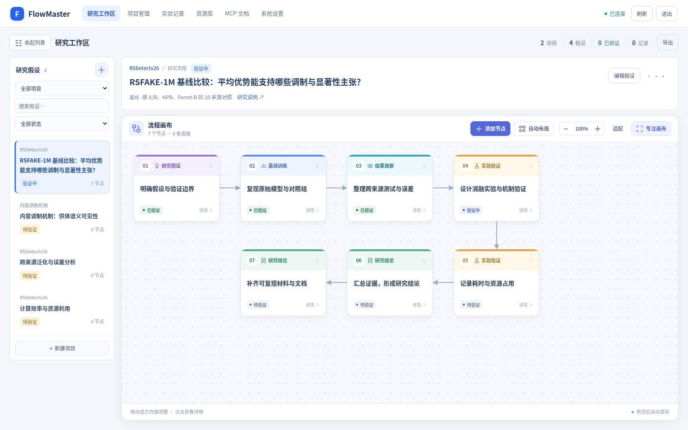

# FlowMaster

中文研究流程与实验记录管理工具。用项目组织研究假设，用可视化节点描述步骤与依赖，用真实实验记录保存结果和证据；支持浏览器操作与外部 MCP 客户端接入。

[站点](https://flow.thanejoss.com) · [快速开始](#快速开始) · [MCP 接入](#mcp-接入) · [部署](#部署) · [文档](#文档)



*界面示意，使用本地示例数据。*

## 能做什么

- **组织研究**：管理项目、假设、流程节点及数据集、代码、文档等资源。
- **编辑流程**：以画布为中心，按节点类型与结果状态区分颜色；拖动或用方向键移动节点，按可用宽度自动换行布局，编辑上游依赖并校验循环连接。
- **追踪结果**：录入和修正实验记录，查看历史日志，导出 JSON；当前结果与关联节点同步更新。
- **连接工具**：通过 MCP 读写同一工作区，使用分级 Token 控制访问权限、有效期和撤销。

技术栈：**Vue 3 + Vite · Cloudflare Workers · D1 · MCP**。所有 Token 访问同一个共享工作区。FlowMaster 不调用 LLM API，也不负责执行实验。

## 快速开始

准备 Node.js **24**（最低 `22.13.0`）和 pnpm **11.25.0**，版本要求见 [package.json](package.json)。

### 1. 安装与配置

```sh
git clone https://github.com/ThaneJoss/flowmaster.git
cd flowmaster
pnpm install --frozen-lockfile
cp .dev.vars.example .dev.vars
```

编辑 `.dev.vars`，将 `ADMIN_TOKEN` 替换为至少 32 字符的随机值，可用 `openssl rand -hex 32` 生成。它是 FlowMaster 的管理员登录凭据，**不是 Cloudflare API Token**。同域开发时 `ALLOWED_ORIGINS` 留空即可。

### 2. 初始化本地数据与构建

```sh
pnpm db:migrate:local
pnpm build
```

先构建前端，让 Worker 可以读取静态资源。以上步骤仅使用本地数据库，不需要生产部署凭据。

### 3. 启动并登录

在两个终端分别运行：

```sh
# 终端一：Worker 与本地 D1，端口 8787
pnpm dev:api
```

```sh
# 终端二：Vite 前端，通常为 http://127.0.0.1:5173
pnpm dev
```

打开 Vite 输出的地址，点击“登录工作区”：服务地址留空，访问 Token 填入 `.dev.vars` 中的 `ADMIN_TOKEN`。前端会将 `/mcp` 请求代理到本地 Worker。

首次登录后，创建项目、添加假设和节点，再选中节点录入实验结果。管理员也可在“系统设置”向空工作区导入示例。

工作区中的假设列表可收起；“专注画布”会隐藏导航和列表，按 Esc 或“退出专注”返回。点击节点先查看结果、研究内容与输入输出，选择“编辑节点”后再修改；关闭详情或切换节点会保留未保存草稿，刷新页面或退出登录则会清除。完整假设说明通过“研究说明”单独阅读。

只需预览构建产物时，在 `pnpm build` 后运行 `pnpm start`，打开 Wrangler 输出的地址即可。

## MCP 接入

| 配置项 | 值 |
| --- | --- |
| 站点端点 | `https://flow.thanejoss.com/mcp` |
| 本地端点 | `http://127.0.0.1:8787/mcp` |
| 传输 | Streamable HTTP，无状态 JSON 响应 |
| 鉴权 | 每个请求携带 `Authorization: Bearer <FlowMaster Token>` |

管理员可在“系统设置”或通过 `tokens_create` 签发 Token：`read` 用于读取，`write` 增加业务写入权限，`admin` 还可管理 Token 和导入示例。将签发的 Token 手动填入 MCP 客户端的认证设置；客户端需支持 Bearer Token，本服务不提供 OAuth。

连接时先完成 `initialize` 和 `notifications/initialized`，再用 `tools/list` 发现工具、`tools/call` 调用。**工具参数以 `tools/list` 返回的 schema 为准**；协议示例与错误处理参考 [API 文档](docs/API.md)。

## 常用命令

| 命令 | 用途 |
| --- | --- |
| `pnpm check` | TypeScript 类型检查 |
| `pnpm build` | 构建前端并校验静态产物 |
| `pnpm test` | 单元与集成测试 |
| `pnpm test:worker` | 构建、打包并检查隔离的本地 Worker / D1 |
| `pnpm run deploy:check` | 前端构建与 Worker dry-run 打包，不发布 |
| `pnpm run deploy:doctor` | 检查本地部署配置；构建产物需先生成 |
| `pnpm run deploy:doctor --remote` | 只读检查远端预览默认绑定；需 Cloudflare API Token |
| `pnpm run builds:logs --account <ID> --build <UUID>` | 只读获取 Cloudflare 构建状态与分页日志；需用户级 Token 的 Workers CI Read 权限 |
| `pnpm run deploy:preview` | 构建并运行 Wrangler preview |
| `pnpm run deploy` | 构建并发布生产 |

## 部署

前端位于 `web/`，构建输出为 `dist/client/`；Worker 入口为 `worker/index.ts`。账号、域名、D1 和静态资源配置统一在 [wrangler.jsonc](wrangler.jsonc)。

自行部署到 Cloudflare 时，先配置账号、域名和 D1 数据库 ID，绑定以下资源：

| 配置 | 要求 |
| --- | --- |
| `DB` | D1 数据库绑定，仓库默认数据库名为 `flowmaster-db` |
| `ADMIN_TOKEN` | Worker Secret，至少 32 字符的随机值；线上单独配置 |
| `ALLOWED_ORIGINS` | 前端与 MCP 同域时留空；跨域时填写逗号分隔的精确 Origin |

新建数据库后执行 `pnpm db:migrate:remote`，再运行 `pnpm run deploy`。发布脚本会先构建并校验产物；预览也使用表中的脚本，以确保静态资源已生成。

使用 Cloudflare Git 构建时，根目录选仓库根目录，构建命令填 `pnpm check`，生产部署命令填 `pnpm run deploy`，非生产分支部署命令填 `pnpm run deploy:preview`，生产分支为 `main`。发布脚本负责前端构建，无需在构建阶段重复执行。仓库通过 `.node-version` 固定 Node.js 24，通过 `packageManager` 声明 pnpm 11.25.0；Cloudflare 中已有的版本覆盖设置也需要与之保持一致，安装时必须包含开发依赖。

**分支预览需要独立配置。** `wrangler preview` 使用 `previews` 配置和 Cloudflare 的预览默认设置，生产 D1 与 Secret 不会直接继承。当前仓库依赖控制台提供预览 `DB` 和 `ADMIN_TOKEN`；生产 dry-run 通过不能证明这些远端设置已就绪。预览数据库应独立创建、迁移，不能误用生产迁移命令。配置步骤、只读诊断及错误定位见 [部署排查](docs/DEPLOYMENT.md)。

<details>
<summary>已有实例与旧接口兼容</summary>

已有实例沿用 D1 数据、数据库绑定与访问 Token；当前更新无需重建数据库。旧 `/api`、`/api/*` 和 `/openapi.json` 已关闭，对外业务接口统一为 `/mcp`。

历史 `source: "agent"` 记录保留，模型配置与模型调用功能已移除。`ENCRYPTION_KEY` 和 `MODEL_ALLOWED_HOSTS` 不再需要；旧模型配置不会被读取或自动删除。

</details>

## 文档

- [MCP 接入参考](docs/API.md)：协议、调用示例与错误处理。
- [界面设计](docs/DESIGN.md)：交互和视觉规范。
- [部署排查](docs/DEPLOYMENT.md)：Cloudflare 生产、分支预览和诊断边界。
- [可靠性审查](docs/RELIABILITY.md)：已修正的配置缺口与待处理的数据规模风险。
- [验证记录](docs/VALIDATION.json)：已记录的检查范围与尚未验证的事项。
