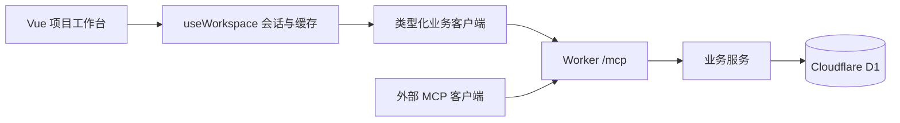

# 架构与数据边界

FlowMaster 为一个共享研究工作区服务。保留 Vue 3 / Vite、Cloudflare Worker / D1 和官方 MCP SDK；项目用于组织研究，不是账号或租户隔离边界。

## 请求路径

浏览器调用类型化业务方法，映射到 MCP 工具。Worker 在协议边界完成解析、Origin / Token 校验，业务服务负责权限、输入、revision、关联和 D1 读写。业务对象直接返回，MCP 包装 `structuredContent`；内部不构造 REST Request 或解码 HTTP Response。

`lib/client.ts` 管理 MCP 传输与会话取消，`lib/workspace-client.ts` 提供业务方法，`web/src/composables/useWorkspace.ts` 管理页面需要的数据范围。旧路径式 `makeClient` 仅用于兼容，不是新页面的调用方式。

每次 HTTP 请求使用独立的无状态 MCP 传输与当前 principal，初始化及工具发现同样鉴权；不跨请求共享用户身份。浏览器与外部客户端共用 MCP，不另建公开 REST 接口。

## 读取、写入与失效

登录按页读取项目。进入项目后按 `projectId` 读取流程和资料；项目记录页和步骤历史分别按需分页，不在登录时预取全库记录。

写入合并服务返回值。步骤操作返回完整流程，记录操作附带受影响流程；小修改不再回读全工作区。记录写入会刷新已打开的记录页和步骤历史，以校正分页顺序与总数；刷新范围仍限于当前视图。返回的 revision 用于接续写入，冲突需读取新内容并核对。

退出 / 换账号取消旧会话；切换项目或筛选后，迟到请求不能覆盖新视图。局部等待状态仅阻塞相关动作。步骤草稿独立于已保存数据，刷新不应覆盖尚未提交的内容。

手动刷新重新读取当前范围，以发现其他 MCP 客户端的修改。本版没有实时订阅，不保证多客户端时刻一致。

## 导出与容量

工作区导出分页读取全部 `projects`、`hypotheses`、`experiments`、`resources`；记录导出遍历当前项目和筛选条件下的全部匹配页。导出不依赖当前缓存，不包含访问 Token、Secret 或模型凭据。

分页导出不是数据库事务快照。并发写入可能改变页间排序或内容，导出可能反映不同时间点；本版不提供严格快照保证。

旧 `workspace_get` 保留 5,000 条 / 8,000,000 UTF-8 字节上限。浏览器登录和导出不依赖它，因此记录总量增长不会单独触发登录时的整库快照限制。

## 约束与安全

业务服务集中执行 scope、revision、DAG 与资料归属校验；界面按钮状态不替代权限判断。结果与步骤投影在同一受保护写入中更新，数据语义见 [API.md](API.md#执行记录与当前结果)。

默认在当前浏览器会话保存凭据；记住登录是显式选项。取消请求无法撤销已完成的服务端写入。研究内容以文本显示，资源链接仅接受 HTTP(S)，新窗口使用 `noopener/noreferrer`。
